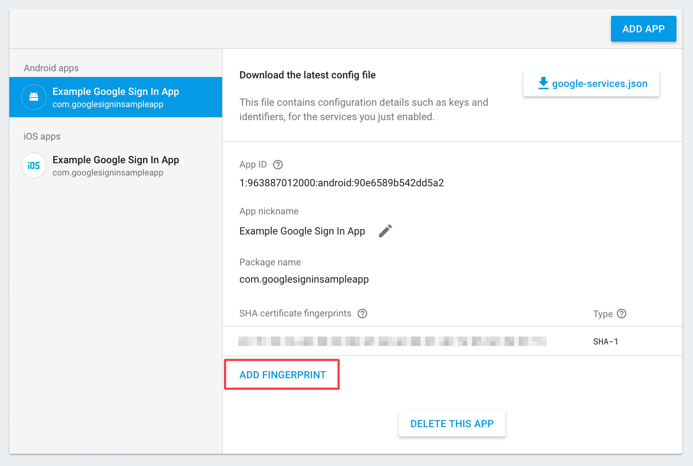
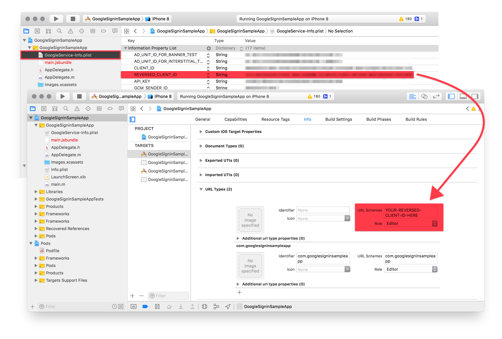

# Example App

### Setup

- To get this running you should have (see [how to get config files](get-config-file.md)):
  - `google-services.json` in your `android/app/`
  - `GoogleService-Info.plist` in `ios/` and linked in XCode by dragging it to the file tree.
- Run `yarn` on project root to install required Javascript dependencies
- Go to `ios/` and run `pod install` to install required native iOS dependencies
- create `config.js` with the following content:

```js
export default {
  webClientId: 'your-id.apps.googleusercontent.com',
};
```

### Running

- Start Metro bundler and watcher `yarn run dev`, be patient: this might take a while since it needs to clean up bunch of stuff
- Run `react-native run-ios` or `react-native run-android` to run the example app

### Troubleshooting

#### `DEVELOPER_ERROR` or `code: 10` on Android

You have an error in your configuration. This might mean lot of different things but one common one is that you have either empty of wrong SHA1 in Firebase console for your project. For this example project you don't need to set up proper keystore so we're using the debug keystore's SHA1.

```sh
keytool -exportcert -keystore <PATH TO YOUR DEBUG OR PRODUCTION KEYSTORE> -list -v
```

To get your debug keystore's SHA1 (password is empty)

```sh
keytool -exportcert -keystore $HOME/.android/debug.keystore -list -v
```

To add the SHA1:

1. Sign in to Firebase and open your project.
2. Click the Settings icon and select Project settings.
3. In the Your apps card, select the package name of the app you need a to add SHA1 to.
4. Click "Add fingerprint".



#### On iOS the app crashes when tapping Sign In button

You're most likely missing `Url Schemes` configuration. How to do it: 
